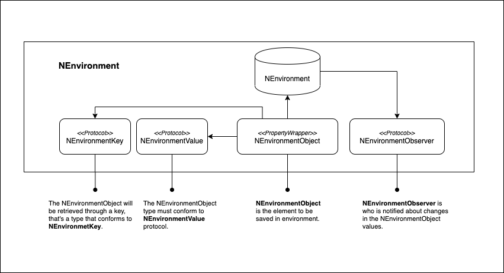

# NEnvironment

NEnvironment is a small library to keep in memory global data. It's inspired in @EnvironmentObject of SwiftUI.
</img>

# Sample:

```Swift
import UIKit
import NEnvironment

struct Person {
    var name: String
    var age: Int
}

extension Person: NEnvironmentValue {
    static var defaultValue = Person(name: "", age: 0)
}


final class EditViewController: UIViewController, NEnvironmentObserver {
    
    @NEnvironmentObject(id: "person") var person: Person
    
    @IBOutlet weak var nameLabel: UILabel!
    @IBOutlet weak var ageLabel: UILabel!
    @IBOutlet weak var nameTextField: UITextField!
    @IBOutlet weak var ageTextField: UITextField!
    
    override func viewDidLoad() {
        registerEnvironmentObserver(#selector(didChangeEnvironment))
    }
    
    override func viewWillAppear(_ animated: Bool) {
        nameTextField.text = person.name
        ageTextField.text = "\(person.age)"
    }
    
    override func viewWillLayoutSubviews() {
        nameLabel.text = person.name
        ageLabel.text = "\(person.age)"
    }
    
    @objc
    private func didChangeEnvironment() {
        view.setNeedsLayout()
    }
    
    @IBAction func didUpdateName(_ sender: UITextField) {
        guard let name = sender.text else { return }
        person.name = name
    }
    
    @IBAction func didUpdateAge(_ sender: UITextField) {
        guard let age = sender.text else { return }
        person.age = Int(age) ?? Int.defaultValue
    }
}

```
